# Inho Kim

**M.S. Student in Energy AI @ KENTECH**

  
  
  

## About Me

I am a Master's student in **Energy AI at KENTECH**.

My research focuses on **Multimodal RAG**, **Time Series Forecasting**, and **AI for Energy Systems**.

## Research Interests

  
  
  
  
  

## Tech Stack

  
  
  
  
  
  
  
  
  
  
  
  
  
  
  

## GitHub Stats

  
  

